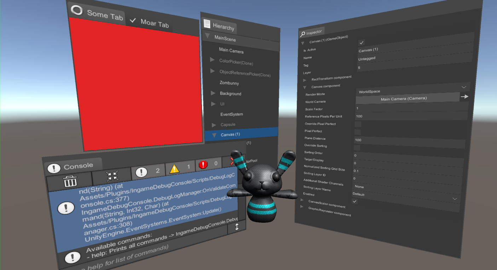

# Dynamic Panels for Unity 3D



*(used external assets in screenshots: [In-game Debug Console](https://github.com/yasirkula/UnityIngameDebugConsole) and [Runtime Inspector & Hierarchy](https://github.com/yasirkula/UnityRuntimeInspector))*

**Available on Asset Store:** https://assetstore.unity.com/packages/tools/gui/dynamic-panels-114126

**Forum Thread:** https://forum.unity.com/threads/released-dynamic-panels-draggable-resizable-dockable-and-stackable-ui-panels.523106/

**Discord:** https://discord.gg/UJJt549AaV

**WebGL Demo:** http://yasirkula.net/DynamicPanelsDemo/

**[GitHub Sponsors ☕](https://github.com/sponsors/yasirkula)**

## ABOUT

This asset helps you create dynamic panels using Unity's UI system. These panels can be dragged around, resized, docked to canvas edges or to one another and stacked next to each other as separate tabs.

## FEATURES

- Supports all canvas modes (Screen Space and World Space)
- Supports multiple canvases (panels can be moved between canvases by dragging)
- Has an extensive Scripting API to create/manipulate panels by code
- Each panel costs 3 additional batches (this number can increase with each tab using a custom icon)

## INSTALLATION

There are 5 ways to install this plugin:

- import [DynamicPanels.unitypackage](https://github.com/yasirkula/UnityDynamicPanels/releases) via *Assets-Import Package*
- clone/[download](https://github.com/yasirkula/UnityDynamicPanels/archive/master.zip) this repository and move the *Plugins* folder to your Unity project's *Assets* folder
- import it from [Asset Store](https://assetstore.unity.com/packages/tools/gui/dynamic-panels-114126)
- *(via Package Manager)* add the following line to *Packages/manifest.json*:
  - `"com.yasirkula.dynamicpanels": "https://github.com/yasirkula/UnityDynamicPanels.git",`
- *(via [OpenUPM](https://openupm.com))* after installing [openupm-cli](https://github.com/openupm/openupm-cli), run the following command:
  - `openupm add com.yasirkula.dynamicpanels`

## FAQ

- **New Input System isn't supported on Unity 2019.2.5 or earlier**

Add `ENABLE_INPUT_SYSTEM` compiler directive to **Player Settings/Scripting Define Symbols** (these symbols are platform specific, so if you change the active platform later, you'll have to add the compiler directive again).

- **"Unity.InputSystem" assembly can't be resolved on Unity 2018.4 or earlier**

Remove `Unity.InputSystem` assembly from **DynamicPanels.Runtime** Assembly Definition File's *Assembly Definition References* list.

## HOW TO

Add **Dynamic Panels Canvas** component to the *RectTransform* inside which your panels will reside. This RectTransform doesn't have to be the Canvas object itself, it can be a child of the canvas and it can have a custom size.

There are two ways to create panels: by using the GUI of Dynamic Panels Canvas or via Scripting API. There are also two types of panels: *free panels* that can be moved around and resized freely and *docked panels* that are moved by the layout system, depending on where it is docked to. A panel can have multiple tabs.


To add a new free panel using the Dynamic Panels Canvas component, simply click the **Add New** button under the *Free Panels* section. Then, click the + button to start adding tabs to that panel. Each tab has 4 properties: the content (*RectTransform*) that will be displayed while the tab is active, a label, an optional icon, and the minimum size of the content associated with the tab. To remove a free panel, select a tab inside the panel and click the **Remove Selected** button.

You can create docked panels by using the buttons under the *Docked Panels* section. To create a panel that is docked to the edge of the Dynamic Panels Canvas, use the buttons next to "*Dock new panel to canvas:*". You can click a panel inside the preview zone (immediately under the *Docked Panels* section) and edit its tabs. You can also dock a panel to the selected panel using the buttons next to "*Dock new panel inside:*".

When you are done, click the Play button to see the magic happen!

There are a couple of settings in Dynamic Panels Canvas that you may want to tweak:

- **Leave Free Space:** when enabled, there will always be some free space in the canvas that docked panels can't fill. Otherwise, docked panels will fill the whole canvas
- **Minimum Free Space:** if *Leave Free Space* is enabled, this value will determine the minimum free space
- **Free Space Target Transform:** if *Leave Free Space* is enabled and a RectTransform is assigned to this variable, the RectTransform's properties will automatically be updated to always match the free space's position and size
- **Prevent Detaching Last Docked Panel:** when enabled, trying to detach the last docked panel from the canvas will automatically fail
- **Panel Resizable Area Length:** size of the invisible resize zones at each side of the panels that allow users to resize the panels
- **Canvas Anchor Zone Length:** size of the Dynamic Panels Canvas' drop zones. When a tab is dragged and dropped onto that area, it will be docked to that edge of the Dynamic Panels Canvas
- **Panel Anchor Zone Length:** size of the panels' drop zones. When a tab is dragged and dropped onto that area, it will be docked to that panel. This area is enabled only for docked panels (you can't dock panels to free panels)
- **Initial Size**: (*docked panels only*) determines the initial size of a docked panel. This is achieved by programmatically resizing the panel after it is created, so this operation may affect the adjacent panels' sizes, as well. This value won't have any effect if left as (0,0)

**NOTE:** if you change the *Resources/DynamicPanel.prefab*, also make sure that the Panel's *Header Height* property is equal to the distance between the top of the panel and the bottom of the *PanelHeader* child object (which holds the tabs at runtime).

### PanelCursorHandler

Adding this component to a GameObject will make the cursor dynamic i.e. its texture will change when it enters a panel's resizable area.


Note that this component won't have any effect on Android and iOS.

## SCRIPTING API

Before using the scripting API, import **DynamicPanels** namespace to your script(s): `using DynamicPanels;`

### PanelUtils

`static Panel CreatePanelFor( RectTransform content, DynamicPanelsCanvas canvas )`: creates and returns a panel with a tab that is associated with the *content*. The panel is created inside the specified Dynamic Panels Canvas. If the content is already part of a panel, then the existing panel is returned

`static PanelTab GetAssociatedTab( RectTransform content )`: if *content* is associated with a tab, returns it; otherwise returns *null*

### Panel

`DynamicPanelsCanvas Canvas { get; }`: returns the Dynamic Panels Canvas that this panel currently belongs to

`PanelGroup Group { get; }`: returns the PanelGroup that this panel currently belongs to (more on that later)

`Vector2 Position { get; }`: returns the anchored position of the panel. The anchor of a panel is located at its bottom-left corner

`Vector2 Size { get; }`: returns the size of the panel

`Vector2 MinSize { get; }`: returns the minimum size of the panel. This value is calculated at runtime using the minimum size values of the panel's tab(s)

`int NumberOfTabs { get; }`: returns the number of tabs the panel has

`int ActiveTab { get; set; }`: returns the index of the currently selected tab. Its value can be changed, as well

`PanelTab this[int tabIndex] { get; }`: returns the tab at the specified index

`bool IsDocked { get; } }`: returns whether the panel is a docked panel or a free panel

`PanelTab AddTab( RectTransform tabContent, int tabIndex = -1 )`: adds a new tab to the panel and sets *tabContent* as its content. If *tabIndex* is not specified, then the tab will be inserted at the end of the tabs list. Newly created tabs will have default label/icon/minimum size values, so it is highly recommended to customize these values afterwards

`PanelTab AddTab( PanelTab tab, int tabIndex = -1 )`: moves the specified tab to this panel

`PanelTab AddTab( string tabID, int tabIndex = -1 )`: same as above

`void RemoveTab( int tabIndex )`: removes a tab from the panel. Be careful when calling this function because the content associated with the tab will also be destroyed!

`void RemoveTab( PanelTab tab )`: same as above

`void RemoveTab( string tabID )`: same as above

`int GetTabIndex( RectTransform tabContent )`: returns the index of a tab, or -1 if the tab is not part of the panel

`int GetTabIndex( PanelTab tab )`: same as above

`int GetTabIndex( string tabID )`: same as above

`PanelTab GetTab( RectTransform tabContent )`: returns the tab that is associated with *tabContent*, or *null* if it is not a part of the panel

`void DockToRoot( Direction direction )`: docks the panel to an edge of the Dynamic Panels Canvas

`void DockToPanel( IPanelGroupElement anchor, Direction direction )`: docks the panel to another panel or panel group. It is not possible to dock a panel to a free panel

`void Detach()`: if the panel is docked, detaches it so that it becomes a free panel

`Panel DetachTab( int tabIndex )`: detaches a tab from the panel, creates a new panel with it and returns the new panel. If the tab is the only tab that the panel has, then the panel itself is detached and returned

`Panel DetachTab( PanelTab tab )`: same as above

`Panel DetachTab( string tabID )`: same as above

`void BringForward()`: if the panel is free, brings it forwards so that it is drawn above all other panels

`void MoveTo( Vector2 screenPoint )`: moves the panel to the specified point on the screen (panel's center will be aligned to the point)

`void ResizeTo( Vector2 newSize )`: resizes the panel. If it is docked, then this change may also affect the adjacent panels

`bool CanResizeInDirection( Direction direction )`: returns whether or not the panel can be resized in the specified direction

`IPanelGroupElement GetSurroundingElement( Direction direction )`: if the panel is docked and if there is a panel/panel group in its specified vicinity, returns it

### PanelTab

`string ID { get; set; }`: a unique identifier for this tab. It is mainly used in the serialization system but it can also be used to quickly access the tab via *PanelNotificationCenter.TryGetTab*. To view/change a tab's ID from the Inspector, right click the DynamicPanelsCanvas component and select "*Toggle Show IDs*"

`Panel Panel { get; }`: returns the panel that the tab belongs to

`int Index { get; set; }`: returns the index of the tab among all tabs on the panel. Its value can be changed

`RectTransform Content { get; }`: returns the content (RectTransform) that is associated with the tab

`Vector2 MinSize { get; set; }`: minimum size of the content

`Sprite Icon { get; set; }`: the icon of the tab

`string Label { get; set; }`: label of the tab

`void AttachTo( Panel panel, int tabIndex = -1 )`: same as *Panel.AddTab*

`Panel Detach()`: same as *Panel.DetachTab*

`void Destroy()`: same as *Panel.RemoveTab*

### PanelGroup

Panel groups are used to hold docked panels together. In a complex hierarchy, a panel group can have child panel groups, as well. A panel group can be either horizontal or vertical. After a panel group is created and populated, it should be docked to an already docked panel or panel group to be a part of the layout.

`PanelGroup( DynamicPanelsCanvas canvas, Direction direction )`: creates a new panel group inside the specified DynamicPanelsCanvas. A *Left* or *Right* **direction** means a horizontal group, whereas a *Top* or *Bottom* direction means a vertical group. Panels in horizontal groups are always arranged from left to right and panels in vertical groups are always arranged from bottom to top; so it doesn't matter if the direction is Left or Right, or Top or Bottom. Just don't pass *None* here

`DynamicPanelsCanvas Canvas { get; private set; }`: returns the Dynamic Panels Canvas that this group currently belongs to

`PanelGroup Group { get; }`: returns the parent PanelGroup that this group currently belongs to. Each Dynamic Panels Canvas has a horizontal panel group at its root that is the root of all docked panels/panel groups in the layout. Free panels, on the other hand, belong to a special panel group called *UnanchoredPanelGroup*, which should never be touched

`Vector2 Position { get; }`: returns the anchored position of the group. The anchor of a group is located at its bottom-left corner

`Vector2 Size { get; }`: returns the size of the group

`Vector2 MinSize { get; }`: returns the minimum size of the group. This value is calculated at runtime recursively using the minimum size values of the docked panels' tabs

`int Count { get; }`: returns the number of elements (panels or child panel groups) in this group

`IPanelGroupElement this[int index] { get; }`: returns the element at the specified index in this group

`void AddElement( IPanelGroupElement element )`: adds an element to the end of the elements list. There is no *RemoveElement* function. Instead, when something changes in the layout (a panel is created/destroyed/moved between groups etc.), Dynamic Panels Canvas is notified and the whole layout is recalculated in *LateUpdate*. During this calculation, elements that belong to other groups are removed from their previous groups automatically

`void AddElementBefore( IPanelGroupElement pivot, IPanelGroupElement element )`: inserts an element in front of a specified element in this group 

`void AddElementAfter( IPanelGroupElement pivot, IPanelGroupElement element )`: inserts an element after a specified element in this group

`void DockToRoot( Direction direction )`: docks the panel group to an edge of the Dynamic Panels Canvas

`void DockToPanel( IPanelGroupElement anchor, Direction direction )`: docks the panel group to another panel or panel group. It is not possible to dock a panel group to a free panel

`void ResizeTo( Vector2 newSize )`: resizes the panel group. This change affects the panels inside the group and may also affect the adjacent panels. Make sure to dock the panel group to an element in the layout before calling this function

`bool IsInSameDirection( Direction direction )`: if this group is horizontal, returns *true* if *direction* is Left or Right. Otherwise, returns *true* if *direction* is Top or Bottom

`IPanelGroupElement GetSurroundingElement( Direction direction )`: if there is an element in the group's specified vicinity, returns it

`void PrintHierarchy()`: prints the hierarchical tree of this group to the console. May be useful for debugging purposes

### DynamicPanelsCanvas

`string ID { get; set; }`: a unique identifier for this canvas. It is used in the serialization system

`void ForceRebuildLayoutImmediate()`: immediately rebuilds the layout of the Dynamic Panels Canvas, if it is dirty. This process involves a couple of steps: elements in groups are validated (elements that no longer belong to that group are removed, empty child groups are deleted and etc.), minimum sizes are calculated, bounds of the elements are recalculated and so on. This step is quite processor intensive and therefore, is not called immediately when something changes. Rather, it is called on LateUpdate to process everything in a single batch (it is called only if something has changed). But there is a drawback: if you modify the layout via Scripting API, you won't be able to access the correct size/position/minimum size values of the layout elements (panels/panel groups) until LateUpdate. Similarly, you won't be able to resize the layout elements in the same frame that you modify them (resizes happen instantly and do not count as modification, but the layout should be up-to-date) or iterate through the elements of a panel group until LateUpdate. To solve this issue, you can simply call this function after modifying the layout to rebuild all layout elements inside the canvas immediately

`void SaveLayout()`: shorthand for *PanelSerialization.SerializeCanvas*

`void LoadLayout()`: shorthand for *PanelSerialization.DeserializeCanvas*

### PanelSerialization

This helper class can save&load the layout of a dynamic canvas via binary serialization at runtime. In the serialized data, tabs are referenced by their IDs, so these IDs should remain consistent. To test serialization in Unity editor while in Play mode, right click the DynamicPanelsCanvas component and select "*Save Layout*" or "*Load Layout*".

`static byte[] SerializeCanvasToArray( DynamicPanelsCanvas canvas )`: serializes the current state of the panels inside the canvas and returns the serialized data. You are responsible from storing this data in a storage

`static void DeserializeCanvasFromArray( DynamicPanelsCanvas canvas, byte[] data )`: deserializes the serialized data and restores the saved state of the panels

`static void SerializeCanvas( DynamicPanelsCanvas canvas )`: internally calls *SerializeCanvasToArray* and saves the data to *PlayerPrefs* (using the *ID* of the canvas as key)

`static void DeserializeCanvas( DynamicPanelsCanvas canvas )`: if a saved data for the canvas exists in *PlayerPrefs*, loads it and then calls *DeserializeCanvasFromArray* internally

### PanelNotificationCenter

Notification center raises certain events during panels' lifecycle. It also holds a reference to each alive panel and therefore, can be used to iterate over all panels conveniently.

`static event PanelDelegate OnPanelCreated`: raised when a new panel is created. *PanelDelegate* takes a *Panel* parameter

`static event PanelDelegate OnPanelDestroyed`: raised when a panel is destroyed

`static event PanelDelegate OnPanelBecameActive`: raised when a panel becomes active in the hierarchy

`static event PanelDelegate OnPanelBecameInactive`: raised when a panel becomes inactive in the hierarchy

`static event PanelDelegate OnPanelClosed`: raised when a panel's close button is clicked. By default, panels' close buttons are hidden. Once a functions is registered to this event, close buttons will become visible. Note that the panel won't be destroyed automatically after clicking the close button, it is your job to implement panel close functionality according to your needs in the registered function(s)

`static event TabDelegate OnTabCreated`: raised when a new tab is created. *TabDelegate* takes a *PanelTab* parameter

`static event TabDelegate OnTabDestroyed`: raised when a new tab is destroyed

`static event TabDelegate OnActiveTabChanged`: raised when a panel's active tab changes

`static event TabDelegate OnStartedDraggingTab`: raised when user starts dragging a tab

`static event TabDelegate OnStoppedDraggingTab`: raised when user stops dragging a tab or system force stops a drag operation

`static event TabDelegate OnTabClosed`: raised when a tab's close button is clicked. By default, tabs' close buttons are hidden. Once a functions is registered to this event, close buttons will become visible. Note that the tab won't be destroyed automatically after clicking the close button, it is your job to implement tab close functionality according to your needs in the registered function(s)

`static int NumberOfPanels { get; }`: returns the number of alive panels (including inactive panels)

`static Panel GetPanel( int panelIndex )`: returns a panel (it can be inactive)

`static bool TryGetTab( string tabID, out PanelTab tab )`: checks whether or not a tab with the specified ID exists and returns it in the *tab* parameter

## EXAMPLE CODE

The following example code creates 3 panels -one with 2 tabs- and generates a L-shaped layout with them. The final output can be seen in the following picture:


```csharp
using UnityEngine;
using DynamicPanels;

public class PanelCreator : MonoBehaviour
{
	public DynamicPanelsCanvas canvas;

	public RectTransform content1, content2, content3, content4;
	public string tabLabel1, tabLabel2, tabLabel3, tabLabel4;
	public Sprite tabIcon1, tabIcon2, tabIcon3, tabIcon4;

	void Start()
	{
		// Create 3 panels
		Panel panel1 = PanelUtils.CreatePanelFor( content1, canvas );
		Panel panel2 = PanelUtils.CreatePanelFor( content2, canvas );
		Panel panel3 = PanelUtils.CreatePanelFor( content3, canvas );

		// Add a second tab to the first panel
		panel1.AddTab( content4 );

		// Set the labels and the (optional) icons of the tabs
		panel1[0].Icon = tabIcon1; // first tab
		panel1[0].Label = tabLabel1;
		panel1[1].Icon = tabIcon4; // second tab
		panel1[1].Label = tabLabel4;

		panel2[0].Icon = tabIcon2;
		panel2[0].Label = tabLabel2;
		panel3[0].Icon = tabIcon3;
		panel3[0].Label = tabLabel3;

		// Set the minimum sizes of the contents associated with the tabs
		panel1[0].MinSize = new Vector2( 300f, 300f ); // first tab
		panel1[1].MinSize = new Vector2( 300f, 300f ); // second tab

		panel2[0].MinSize = new Vector2( 300f, 300f );
		panel3[0].MinSize = new Vector2( 300f, 300f );

		// Create a vertical panel group
		PanelGroup groupLeftVertical = new PanelGroup( canvas, Direction.Top ); // elements are always arranged from bottom to top
		groupLeftVertical.AddElement( panel1 ); // bottom panel
		groupLeftVertical.AddElement( panel2 ); // top panel

		// Dock the elements to the Dynamic Panels Canvas (the order is important)
		panel3.DockToRoot( Direction.Bottom );
		groupLeftVertical.DockToRoot( Direction.Left );

		// Rebuild the layout before attempting to resize elements or read their correct sizes/minimum sizes
		canvas.ForceRebuildLayoutImmediate();

		// It is recommended to manually resize layout elements that are created by code and docked.
		// Otherwise, their sizes will not be deterministic. In this case, we are resizing them to their minimum size
		groupLeftVertical.ResizeTo( new Vector2( groupLeftVertical.MinSize.x, groupLeftVertical.Size.y ) );
		panel3.ResizeTo( new Vector2( panel3.Size.x, panel3.MinSize.y ) );
	}
}
```
